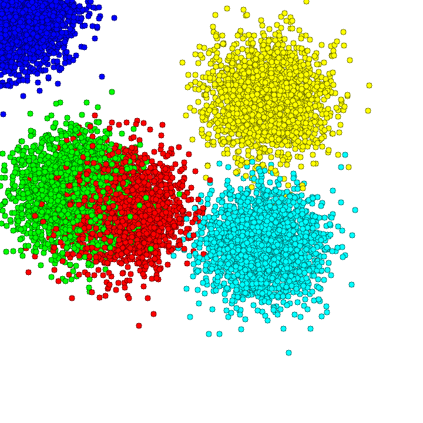
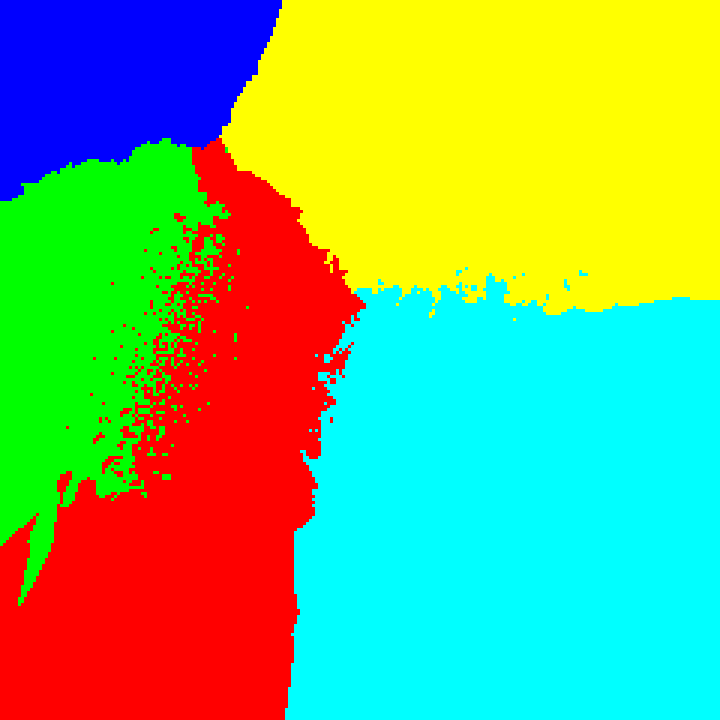

# KNN Visualized

This repository contains an implementation of the K-Nearest Neighbors (KNN) algorithm, parallelized using CUDA and pthreads for performance optimization.

## Visualizations

<table>
  <tr>
    <td></td>
    <td></td>
  </tr>
  <tr>
    <td align="center">Figure 1: point placement</td>
    <td align="center">Figure 2: classification area</td>
  </tr>
</table>


## Introduction

The K-Nearest Neighbors (KNN) algorithm is a simple, yet powerful supervised machine learning algorithm used for classification and regression tasks. This implementation leverages parallel computing techniques to speed up the computation. CUDA is used for GPU parallelization, and pthreads are used for CPU parallelization.

## Compilation Instructions

To compile the serial version of the KNN implementation:

```bash
gcc -o serial serial.c -lpng -lm
```

To compile the pthreads version of the KNN implementation:

```bash
gcc -o pthread pthread.c -lpng -lm -lpthread -O3
```

To compile the CUDA version of the KNN implementation:

```bash
nvcc cuda.cu -o cuda -lpng -lm
```

## Repository Structure

- `dataset/` - Contains datasets used for the KNN algorithm.
- `output/` - Directory for output files.
- `tests/` - Contains test files.
- `cuda` - CUDA parallelized code.
- `cuda.cu` - CUDA source file.
- `draw` - Drawing utilities.
- `draw.c` - Source file for drawing utilities.
- `pthreads` - Pthreads parallelized code.
- `pthreads.c` - Pthreads source file.
- `serial` - Serial code.
- `serial.c` - Serial source file.
- `KNN_visualized_EN.pdf` - Documentation in English.
- `KNN_visualized_IT.pdf` - Documentation in Italian.
- `LICENSE` - License for the repository.


## License

This project is licensed under the MIT License - see the `LICENSE` file for details.

